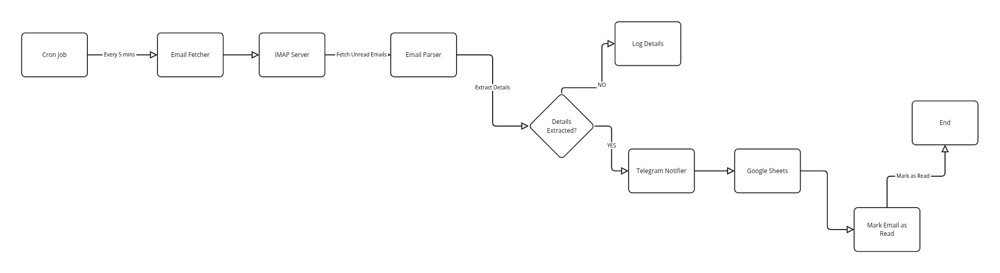

# Automated Payment Verification System



## Overview
The **Automated Payment Verification System** is a Python-based tool designed to streamline the process of tracking and verifying client payments received via bank transaction emails. It automates the extraction of payment details from emails, sends notifications via Telegram, and is scheduled to run periodically to ensure timely updates. Built with modularity and extensibility in mind, this system aims to reduce manual effort and improve accuracy in payment reconciliation.

## Why This Project?
Managing client payments manually—especially when payments are confirmed via email—can be time-consuming and error-prone. Businesses or individuals often receive transaction notifications from banks (e.g., BCA) and need to extract details like transaction IDs, client names, and amounts to verify against expected payments.

### **Key Benefits:**
- **⏳ Save Time:** Eliminate manual email checking and data entry.
- **❌ Reduce Errors:** Automate parsing and verification to avoid human mistakes.
- **📩 Provide Real-Time Alerts:** Notify users instantly via Telegram when payments are received.

## Problem It Solves
This system addresses the inefficiency of manually monitoring bank notification emails by:
- 📥 Fetching unread emails from an IMAP server (e.g., Gmail).
- 🔍 Extracting key payment details (e.g., transaction ID, amount, client name).
- 📢 Sending immediate Telegram notifications for visibility.
- ⏲️ Running automatically via cron jobs to ensure continuous monitoring.

## Features (Implemented So Far)
✅ **Email Retrieval:** Connects to an IMAP server (e.g., Gmail) to fetch unread emails based on configurable filters (subject keywords, sender domains).  
✅ **Email Parsing:** Extracts payment details from email bodies (text/plain, text/html) and attachments (PDFs, assumed as octet-streams) using regex-based rules.  
✅ **Telegram Notifications:** Sends payment details (e.g., transaction ID, client name, amount) to a Telegram chat when a payment is parsed.  
✅ **Mark as Read:** Marks processed emails as read to avoid reprocessing.  
✅ **Cron Scheduling:** Runs every 5 minutes via a cron job to check for new payments.  
✅ **Configuration Management:** Uses a secure `config.yaml` file for email credentials, parsing rules, and notification settings.  

## Project Structure
```
payment_verification/
├── config/
│   └── config.yaml         # Configuration file (ignored by Git)
├── logs/
│   └── cron.log           # Log file for cron job output
├── database/              # Placeholder for future DB
├── scripts/
│   └── test_imports.py    # Dependency check script
├── utils/
│   ├── config_loader.py   # Loads and validates config.yaml
│   ├── email_utils.py     # Email fetching and parsing logic
│   └── notification_utils.py # Telegram notification logic
├── main.py                # Main script with cron/scheduling logic
├── requirements.txt       # Python dependencies
└── README.md              # This file
```

## Prerequisites
- **Python 3.8+**
- **A Unix-based system** (e.g., Linux, macOS) for cron jobs (Windows Task Scheduler alternative possible)
- **Gmail account** with IMAP enabled and an App Password if 2FA is on
- **Telegram account** and a bot token/chat ID (see Setup [Telegram Setup](#telegram-setup))

## Setup Instructions
### **1️⃣ Clone the Repository**
```bash
git clone https://github.com/hermangoncalves/automated-payment-verification.git
cd automated-payment-verification
```

### **2️⃣ Create and Activate Virtual Environment**
```bash
python3 -m venv venv
source venv/bin/activate  # Linux/macOS
venv\Scripts\activate     # Windows
```

### **3️⃣ Install Dependencies**
```bash
pip install -r requirements.txt
```

### **4️⃣ Configure the System**
Copy your `config.yaml` to `config/` (do not commit this file):
```yaml
email:
  imap_server: imap.gmail.com
  username: your_email@gmail.com
  password: your_app_password
google_sheets:
  spreadsheet_id: your_spreadsheet_id
  credentials_file: config/credentials.json
parsing_rules:
  BCA:
    transaction_id: "Número de Documento" 
    client_name: "1º Titular da conta ordenante"
    amount_paid: "Valor do movimento"
    payment_date: "Data-valor"
    bank_reference: "Conta do beneficiário"
    description: "Descritivo do movimento"
notifications:
  telegram:
    bot_token: telegramm_bot_token
    chat_id: your_telegram_chat_id
filtering:
  subject_keywords: ["Internet Banking | Extrato integrado"]
  sender_domains: ["notification@bca.cv"]
  fetch_unread_only: true
  time_window_minutes: 60 # Fetch email from the last x minutes
```
📌 **Update with:**
- Your Gmail credentials, Telegram bot token, and chat ID.
- Adjust `parsing_rules` to match your bank email format.
- Ensure `config/` is in `.gitignore`.

### **5️⃣ Telegram Setup**
1. Create a Telegram bot with `@BotFather` to get a `bot_token`.
2. Send a message to your bot and use `@GetMyIDBot` to get your `chat_id`.

### **6️⃣ Set Up Cron Job**
Make `main.py` executable:
```bash
chmod +x main.py
```
Edit crontab:
```bash
crontab -e
```
Add (replace paths with your absolute paths):
```bash
*/5 * * * * /bin/bash /home/user/automated-payment-verification/run_script.sh
```

## Usage
### **Run Manually:**
```bash
python main.py
```
Fetches unread emails, parses them, sends Telegram notifications, and marks emails as read.

### **Run via Cron:**
Once the cron job is set, it runs every **5 minutes automatically**.

### **Check logs:**
```bash
cat logs/cron.log
```

## Troubleshooting
### **Cron Fails:**
- Check `logs/cron.log`. Common fixes:
  - Ensure absolute paths in `crontab`.
  - Verify `config.yaml` exists and is readable.
  - Run manually using the same cron command to debug.

### **No Emails Fetched:**
- Check if filter criteria in `config.yaml` match your inbox.

### **Parsing Fails:**
- Adjust `parsing_rules` regex to match email content.

## Future Enhancements (Planned Issues)
- ✅ **Payment Verification:** Match against a client database.
- ✅ **Google Sheets Integration:** Log payments to a spreadsheet.
- ✅ **Logging:** Detailed event/error logging.
- ✅ **CLI:** Manual reprocessing of failed transactions.

## Contributing
Feel free to fork, submit issues, or PRs to enhance functionality or fix bugs.

## License
This project is **unlicensed for now**—use it as you see fit!

